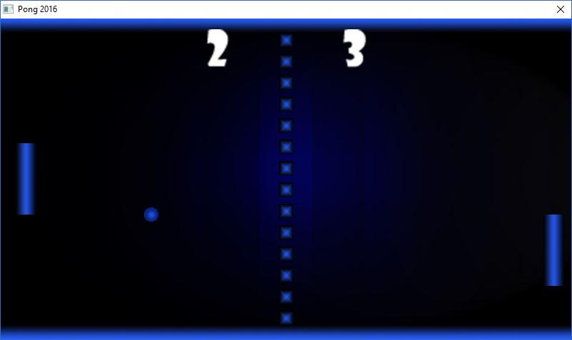

# 🎮 Pong 2016

## 📘 Description
Petit jeu Pong codé en PureBasic.  
Deux joueurs s’affrontent avec des raquettes pour renvoyer la balle et marquer des points.  
Idéal pour tester vos réflexes et vous amuser en local.

## 📷 Aperçu

*Le gameplay classique en image !*

---

## 🛠️ Fonctionnalités
- Mode 2 joueurs sur le même clavier  
- Scores affichés en temps réel  
- Sons et effets visuels de balle et raquette  

## 🕹️ Contrôles / Utilisation
- Joueur 1 : `W` / `S` pour monter / descendre  
- Joueur 2 : Flèches `↑` / `↓` pour monter / descendre  
- Commencer une nouvelle partie avec `Enter`  
- Quitter le jeu avec `Esc`  

## ⚙️ Installation / Compilation
1. Ouvrir le fichier `.pb` dans PureBasic  
2. Compiler ou exécuter le projet  
3. Jouer et profiter du Pong classique  

## 📄 Licence
Tous droits réservés – usage personnel uniquement.  

## 📝 Changelog
- **v1.0** – Version initiale avec mode 2 joueurs  
- **v1.1** – Ajout des sons et effets visuels  
- **v1.2** – Correction des collisions et du score